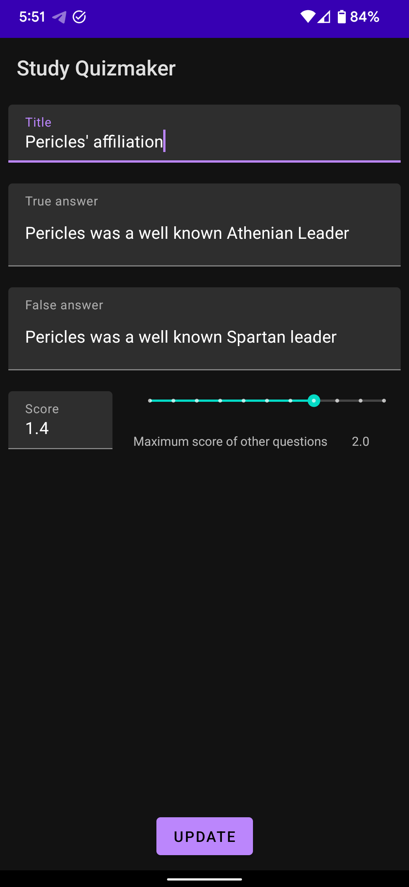

# Study Quizmaker
<table>
    <tr>
        <td>
            
        </td>
        <td>
            An Android app for Students.
        </td>
    </tr>
</table>

Prepare and solve your own quizzes, with various question types including multiple options, many options, true or false, and simple questions.

## Manage question categories
This app allows you to categorize questions based on subjects and topics, and choose a color for each of them:

<table>
    <tr>
        <td></td>
        <td></td>
    </tr>
</table>

---

## Add questions and set their desired score
You can also add and edit the score of multiple types of questions, such as multiple choice questions, true or false questions, simple questions, etc.

<table>
    <tr>
        <td></td>
        <td></td>
    </tr>
</table>

### Question types
<table>
    <tr>
        <th>Questions with multiple valid answers</th>
        <th>Questions with one valid answer (Multiple Choice)</th>
    </tr>
    <tr>
        <td></td>
        <td></td>
    </tr>
    <tr>
        <th>True or false questions</th>
        <th>Simple questions</th>
    </tr>
    <tr>
        <td></td>
        <td></td>
    </tr>
</table>

---

## Start answering some questions!
<table>
    <tr>
        <td></td>
        <td></td>
        <td></td>
    </tr>
    <tr>
        <td></td>
        <td></td>
        <td></td>
    </tr>
</table>

---

## Review your answers and the score history

<table>
    <tr>
        <td></td>
        <td></td>
    </tr>
    <tr>
        <td></td>
        <td></td>
    </tr>
</table>